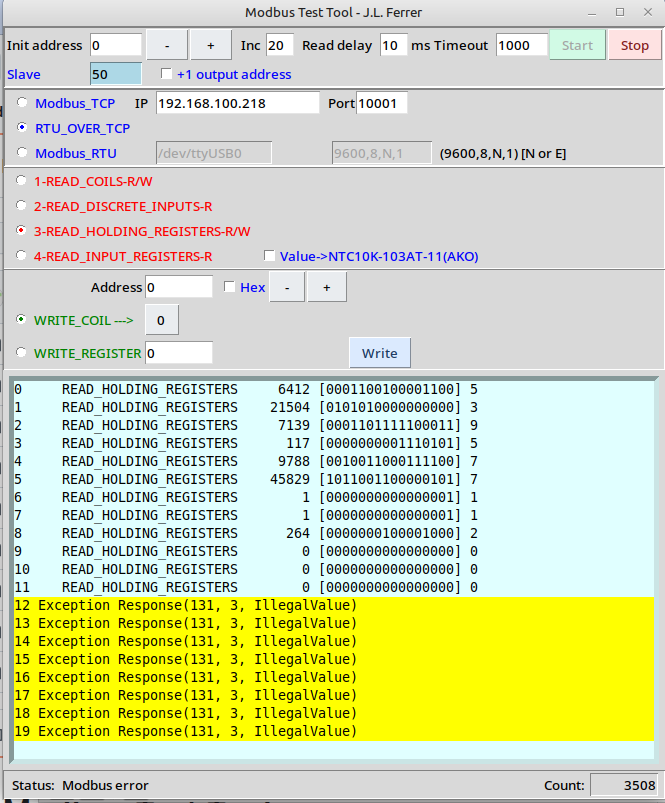
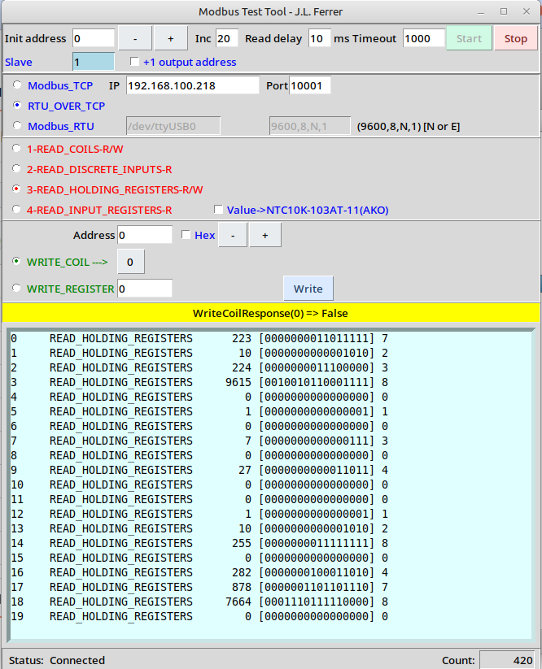

# Modbus Test Tool

[Versión en español](README.md)

A desktop application written in Python and Tkinter for testing Modbus devices. It continuously reads coils and registers and can write coils and holding registers over TCP or serial connections.

This project started approximately 15 years ago as a small utility for testing Modbus devices. Since then, it has evolved through practical use with real equipment, gaining new features and support for different connection types.

<p align="center">
  
</p>

## Screenshots

<p align="center">
  
  
</p>

## Features

- Supports **Modbus TCP**, **RTU over TCP**, and **Modbus RTU** connections.
- Continuous reading of:
  - Coils (`01`).
  - Discrete inputs (`02`).
  - Holding registers (`03`).
  - Input registers (`04`).
- Writes coils and holding registers.
- Accepts write addresses in decimal or hexadecimal format.
- Displays register values in decimal and binary, including the number of active bits.
- Optional `+1` address display offset without changing the actual Modbus request.
- Optional temperature conversion for an AKO NTC 10K 103AT-11 sensor.
- Automatically saves the latest settings to `config_mbus.json`.

## Requirements

- Python 3.8 or later.
- Tkinter.
- A Modbus device accessible over a network or serial port.

> Executables are also available for **Linux** and **Windows**. Python and its dependencies are not required when using one of these versions.

On Debian, Ubuntu, and derivatives, you can install Tkinter with:

```bash
sudo apt install python3-tk
```

On Windows, Tkinter is normally included with the official Python installation.

## Linux and Windows executables

Download the executable for your operating system from the repository files or published releases:

- **Linux**: download the Linux executable, grant execution permission if necessary, and run it.

  ```bash
  chmod +x testmodbus
  ./testmodbus
  ```

- **Windows**: download the `.exe` file and run it directly.

The executables include the required dependencies. The following sections explain how to install and run the application from source.

## Installation

Clone the repository and enter its directory:

```bash
git clone <REPOSITORY-URL>
cd testModbus
```

Create a virtual environment and install the dependencies:

```bash
python3 -m venv .venv
source .venv/bin/activate
python -m pip install -r requirements.txt
```

On Windows, activate the environment with:

```powershell
.venv\Scripts\activate
```

## Running the application

```bash
python testmodbus1.py
```

## Usage

### 1. Configure the connection

Select one of the available modes:

- **Modbus_TCP**: enter the device IP address and port. The standard port is `502`.
- **RTU_OVER_TCP**: enter the IP address and port of the RTU/TCP gateway.
- **Modbus_RTU**: enter the serial port and its parameters, for example `/dev/ttyUSB0` and `9600,8,N,1`. On Windows, the port may be `COM3`, `COM4`, etc.

The **Read delay** field sets the pause between Modbus requests, from `0` to `999` milliseconds. Some devices require this pause to respond correctly. **Timeout** is the maximum communication wait time, and **Slave** is the Modbus unit identifier.

### 2. Read data

1. Enter the first address in **Init address**.
2. In **Inc**, enter the number of addresses to scan, from 1 to 20.
3. Select the type of data to read.
4. Click **Start** to begin continuous scanning.
5. Click **Stop** to stop scanning and close the connection.

The list displays the address, read type, received value and, for registers, its binary representation and number of active bits.

> Addresses are internally zero-based. The **+1 output address** option changes only the address displayed on screen.

### 3. Write data

In the write section:

1. Enter the address in **Address**.
2. Enable **Hex** to enter it in hexadecimal format.
3. Select **WRITE_COIL** or **WRITE_REGISTER**.
4. Enter the coil state (`0` or `1`) or register value.
5. Click **Write**.

Register values from `-65535` to `65535` are accepted. Before writing, always check the device register map and the limits specified by its manufacturer.

## Configuration

The application automatically loads and updates `config_mbus.json`. The file contains settings such as:

```json
{
  "ip": "192.168.1.100",
  "port": "502",
  "slave": "1",
  "inc": "20",
  "delay": "1000",
  "read_delay": "10",
  "address": "1",
  "modbusTcp": 1,
  "com_port": "/dev/ttyUSB0",
  "baudrate": "9600,8,N,1",
  "addressPlusOne": 0,
  "hex": 0
}
```

The `modbusTcp` value identifies the connection mode: `1` for Modbus TCP, `2` for RTU over TCP, and `3` for Modbus RTU.

## Serial port permissions on Linux

If a permission error occurs while opening `/dev/ttyUSB0`, add your user to the group that controls serial ports (usually `dialout`):

```bash
sudo usermod -aG dialout "$USER"
```

Log out and sign in again to apply the change.

## Warning

Writing coils or registers can change the state of a real installation. Only use this tool if you understand the device's Modbus map and can operate the equipment safely.

## Feedback

If you find this tool useful, I would be glad to hear about it. Feel free to leave a message, open an issue, or share any suggestions that could help improve the project.
